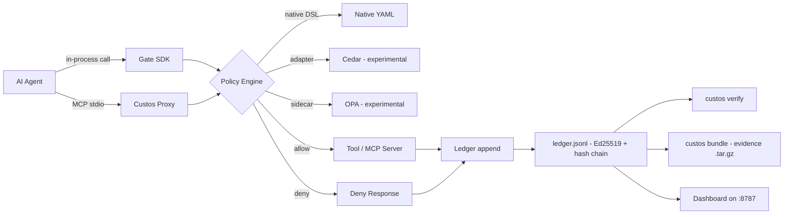
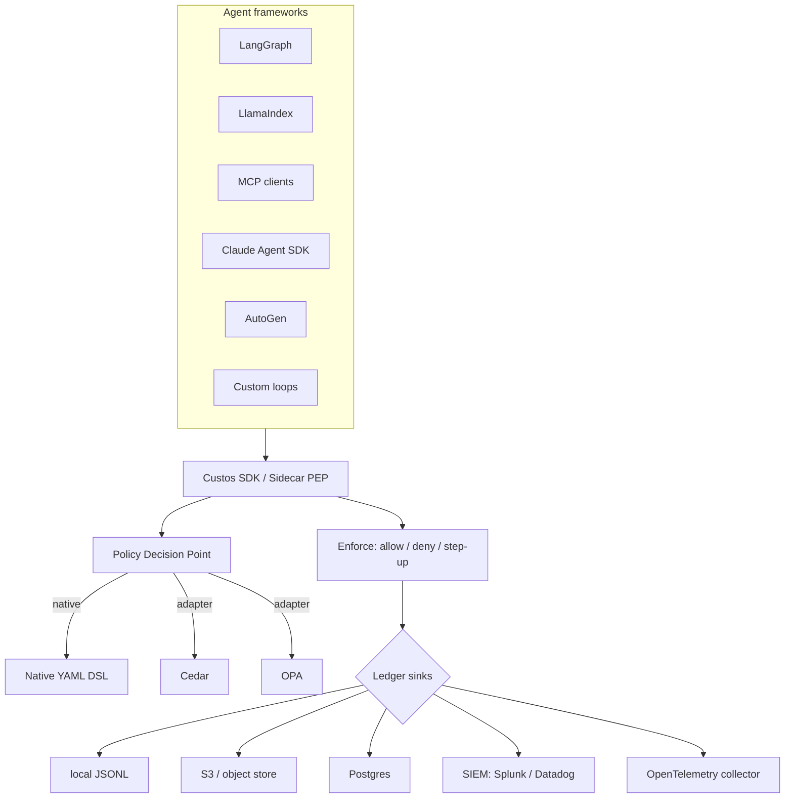

# Custos Architecture

Custos is a **Policy Enforcement Point (PEP)** with a native **Policy Decision Point (PDP)** and a cryptographic audit ledger for AI-agent tool calls. It sits between an AI agent and the tools that agent can invoke — evaluating each call against policy before execution and recording a signed, hash-chained decision record after.

This document walks the current architecture, the request flow, and the roadmap toward a framework-independent PEP.

---

## Diagram 1 — Current architecture (data flow)



Custos ships two integration surfaces. The **Gate SDK** (`packages/custos-py/src/custos/sdk.py`, `packages/custos-js/src/sdk.ts`) is in-process — an agent calls `gate.call(tool, args, fn)` and Custos evaluates policy, runs `fn`, and writes a record. The **stdio MCP proxy** (`packages/custos-py/src/custos/proxy.py`, `packages/custos-js/src/proxy.ts`) fronts any MCP server without server changes. Both funnel into the same PDP (`policy.py` / `policy.ts`) which defaults to the native YAML DSL but can delegate to Cedar or OPA adapters. Every decision — allow, deny, error — is appended to the ledger (`ledger.py` / `ledger.ts`) as an Ed25519-signed, SHA-256 hash-chained JSONL row.

---

## Diagram 2 — Request authorization sequence

```mermaid
sequenceDiagram
    autonumber
    participant Agent as AI Agent
    participant Gate as Gate / Proxy
    participant PDP as Policy Engine
    participant Tool as Tool / MCP Server
    participant Ledger as Ledger (JSONL)

    Agent->>Gate: tool call (name, args, trace_id)
    Gate->>PDP: evaluate(ctx)

    alt policy allows
        PDP-->>Gate: ALLOW (rule_id, reason)
        Gate->>Tool: invoke(args)
        Tool-->>Gate: result
        Gate->>Ledger: append(record: ALLOW, args_hash, result_hash, latency_ms)
        Gate-->>Agent: result
    else policy denies
        PDP-->>Gate: DENY (rule_id, reason)
        Gate->>Ledger: append(record: DENY, args_hash, rule, reason)
        Gate-->>Agent: deny error (-32001 for proxy; CustosDenied for SDK)
    end
```

The PDP is consulted **before** execution. On allow, the tool runs and both `args_hash` and `result_hash` are recorded — the raw values never touch the ledger, preserving privacy. On deny, no tool code runs; the deny is still recorded with the matching rule id and human reason so the audit trail captures rejected attempts. The proxy returns MCP JSON-RPC error `-32001`; the SDK raises `CustosDenied` (Python) or throws (Node); the Claude Agent SDK adapter returns an `isError: true` MCP result the model can react to.

---

## Diagram 3 — Future framework-independent architecture (roadmap)



The roadmap positions Custos as **framework-agnostic authorization infra** rather than an MCP-only tool. The same PEP + PDP + ledger runs behind whatever loop your agent uses — LangGraph, LlamaIndex, MCP, Claude Agent SDK, AutoGen, or a hand-rolled loop. The ledger becomes a pluggable sink layer so operators can keep local JSONL for portability while also streaming to S3, Postgres, a SIEM, or an OpenTelemetry collector for correlation with the rest of the observability stack. Adapters for LangGraph and Claude Agent SDK exist today (`packages/custos-py/src/custos/adapters/langgraph.py`, `.../claude_agent.py`, and the Node equivalents); LlamaIndex, AutoGen, and additional sinks are the next wave.

---

## Design decisions

**Local JSONL by default.** The ledger is a single append-only file per gate. This keeps the default install zero-infrastructure — no database, no service dependency — and, more importantly, makes the ledger *portable*. Any auditor with the file and the public key can verify the chain offline. `custos bundle` packages this plus policy snapshots as a signed `.tar.gz`.

**Ed25519.** 32-byte public keys, 64-byte signatures, deterministic (no per-signature RNG needed), fast to verify. Small enough to embed the public key in each record's server context; fast enough that per-record signing does not dominate latency.

**Hash chain, not Merkle tree.** Audit reviews are linear ("show me every call to `write_file` yesterday"), so a linear `prev_hash` chain matches the access pattern. Merkle trees pay for random-position proofs Custos does not need. Detection semantics are identical — any modification breaks the chain — with less code and no rebalancing.

**`args_hash` only.** Raw tool arguments frequently contain sensitive data (paths, prompts, PII, secrets). Custos hashes them with SHA-256 and stores only the hash. Investigators who need argument contents keep their own retention regime; the ledger stays low-sensitivity and safe to ship to compliance.

**First-match-wins.** Rules evaluate top-to-bottom; the first matching rule decides. This is the same idiom as iptables, security groups, and most WAF rulesets — predictable and easy to reason about. Put deny rules first for path traversal / dangerous tools; allow rules follow.

**Native DSL plus optional Cedar / OPA.** Most teams don't need a full policy language on day one. The native YAML DSL (prefix / suffix / contains / regex / in / not_in / eq / ne / gt / lt / gte / lte / exists) covers the common cases with zero external dependencies. Teams already invested in Cedar or OPA can plug their engine in via the adapter — the PDP interface is small on purpose. Cedar and OPA adapters are shipped as **experimental** today.
